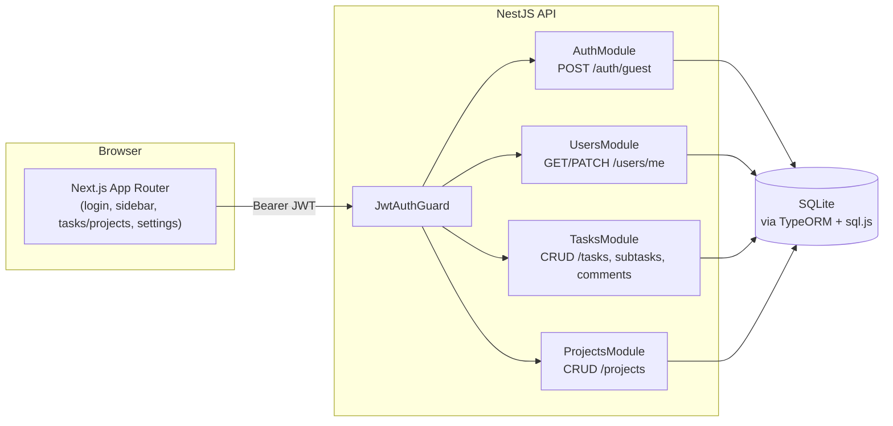

# AbleSpace Task Management System

A full-stack task management app built for the AbleSpace Full Stack Developer
(Fresher) technical assessment — a guest-authenticated kanban board with a
NestJS API, tested, containerized, and CI-checked on every push.

[](https://github.com/Vanshika-gupta001/ablespace-assessment/actions/workflows/ci.yml)

**Live demo:** https://ablespace-assessment-psi.vercel.app/tasks

**API docs:**  https://ablespace-backend-rv69.onrender.com
              (Swagger UI, see [API documentation](#api-documentation))

---


## Tech stack

| Layer      | Choice                                            |
| ---------- | -------------------------------------------------- |
| Frontend   | Next.js 14 (App Router), TypeScript, Tailwind CSS |
| Backend    | NestJS, TypeScript                                |
| Database   | SQLite via TypeORM + `sql.js` (pure JS, no native build step) |
| Auth       | Guest login → JWT (no passwords, no PII)          |
| API docs   | Swagger / OpenAPI (`@nestjs/swagger`)             |
| Testing    | Jest (unit + integration) on the backend, Playwright (e2e) on the frontend |
| Tooling    | ESLint, Prettier, Docker, GitHub Actions CI        |

## Features

- **Sidebar navigation** — workspace switcher, Tasks / Projects / Settings
- **Tasks** — List view (grouped by To Do / Doing / Completed / On Hold,
  collapsible, sortable-by-priority table) and Board view (drag-and-drop
  kanban), toggle between them
- **Task detail page** — inline-editable title/description, status,
  priority, labels, due date, subtasks, and a comment/updates thread
- **Projects** — a flat list (Project / Priority / Lead / Due Date),
  create/edit/delete
- **Settings** — profile (name, title, username), light/dark theme, and a
  6-color accent picker (Amber, Blue, Pink, Rose, Emerald, Black) that
  persists and applies instantly via a CSS variable
- **Guest login** — no signup, no passwords; a "Login with Google" button
  is shown to match the design but is intentionally disabled (see
  [Design decisions](#design-decisions))

## Architecture



- **Guest login:** `POST /auth/guest` creates a new guest `User` row and
  returns a signed JWT — no signup, no password, no PII collected.
- **Tasks:** REST CRUD under `/tasks`, protected by a JWT guard, always
  scoped to `req.user.userId` so guests never see each other's data.
  Subtasks are plain tasks with a `parentId`; `/tasks/:id/subtasks` and
  `/tasks/:id/comments` are nested under the parent task. Validated with
  `class-validator` DTOs and a global `ValidationPipe` (`whitelist: true`)
  that strips/rejects unexpected fields.
- **Projects:** Same CRUD/ownership pattern as Tasks, in its own module
  and table, without the status/subtask/comment features Tasks has (the
  design doesn't show them for Projects).
- **List/Board views:** List groups tasks by status into collapsible
  sections with a data table (Task / Priority / Members / Due Date);
  Board is the same data as draggable kanban columns. Both read from the
  same in-memory task state, so switching views is instant.
- **Theme + color mode:** Light/dark persisted via a `dark` class on
  `<html>`; the 6-color accent picker persists separately and is applied
  through a `data-accent` attribute driving a CSS custom property, so
  switching doesn't require a Tailwind rebuild.
- **Responsiveness:** Sidebar collapses into a mobile drawer below `sm:`;
  tables scroll horizontally on narrow viewports; the board stacks to a
  single column.

## Project structure

```
ablespace-assessment/
├── .github/workflows/ci.yml   CI: lint, build, unit + e2e tests
├── backend/                   NestJS API
│   ├── src/
│   │   ├── auth/               Guest login, JWT strategy/guard
│   │   ├── users/               User entity + profile service
│   │   ├── tasks/                Task + Comment entities, DTOs, service, controller
│   │   └── projects/             Project entity, DTOs, service, controller
│   └── test/                   Integration (e2e) tests
├── frontend/                  Next.js app
│   ├── app/
│   │   ├── page.tsx            Login (guest / Google-disabled)
│   │   └── (app)/               Sidebar-wrapped shell
│   │       ├── tasks/            List/Board views + create modal
│   │       ├── tasks/[id]/       Task detail: subtasks, labels, comments
│   │       ├── projects/         Project list + create/edit modal
│   │       └── settings/         Profile, theme, color mode
│   ├── components/             Sidebar, TaskListTable, Column, modals, menus...
│   ├── context/                 Theme, Auth, Toast providers
│   └── e2e/                    Playwright tests
├── docker-compose.yml         Run both services with one command
└── render.yaml                Render deployment blueprint (backend)
```

## Getting started

### Option A — Docker (recommended, zero local setup)

```bash
docker compose up --build
```

Frontend → http://localhost:3000, Backend → http://localhost:4000,
Swagger → http://localhost:4000/api/docs. Data persists in a named Docker
volume between runs.

### Option B — Run locally

**Backend**

```bash
cd backend
cp .env.example .env
npm install
npm run start:dev
```

Starts on http://localhost:4000. SQLite creates a local `ablespace.sqlite`
file automatically — no separate database setup needed.

**Frontend** (in a second terminal)

```bash
cd frontend
cp .env.local.example .env.local
npm install
npm run dev
```

Starts on http://localhost:3000. Click **Continue as guest** to create a
session and land on the board.

## Testing

**Backend — unit + integration tests**

```bash
cd backend
npm test              # unit tests (services, isolated with mocked repos)
npm run test:cov      # unit tests with coverage report
npm run test:e2e      # integration tests against a real in-memory DB
```

Unit tests cover `TasksService`, `AuthService`, and `UsersService` in
isolation with mocked repositories. The e2e suite boots the actual Nest
application against an in-memory `sql.js` database and exercises the real
HTTP layer: guest login, creating/listing/deleting a task, subtasks scoped
to their parent, comments recorded under the current display name, one
guest unable to read another guest's task, auth rejection without a
token, and DTO validation rejection.

**Frontend — end-to-end tests**

```bash
cd frontend
npm run test:e2e       # headless
npm run test:e2e:ui    # interactive Playwright UI
```

The backend must already be running on port 4000 (Playwright only boots
the frontend dev server). Tests cover guest login, task creation, toggling
between List and Board views, opening a task detail page and adding a
comment, and theme persistence across a reload.

## API documentation

With the backend running, open **http://localhost:4000/api/docs** for
interactive Swagger UI — every endpoint, request/response shape, and
validation rule is documented and testable directly from the browser.

| Method | Path        | Description                   | Auth |
| ------ | ----------- | ------------------------------ | ---- |
| POST   | /auth/guest | Create a guest session (JWT)  | No   |
| GET    | /tasks      | List the current user's tasks | Yes  |
| GET    | /tasks/:id  | Get one task                  | Yes  |
| POST   | /tasks      | Create a task                 | Yes  |
| PATCH  | /tasks/:id  | Update a task                 | Yes  |
| DELETE | /tasks/:id  | Delete a task                 | Yes  |

## Deployment

**Backend → Render** (one-click via the included blueprint)

1. Push this repo to GitHub.
2. In Render, choose **New → Blueprint**, point it at the repo — it reads
   `render.yaml` and provisions a free web service.
3. After the first deploy, set the `CORS_ORIGIN` env var to your Vercel URL
   (step below) and redeploy.

> **Data persistence on the free tier:** Render's free web service has no
> persistent disk (that requires a paid Starter instance or higher), so the
> SQLite file resets on every redeploy and whenever the free instance spins
> back up after being idle. That's an acceptable trade-off here — every
> session starts from a fresh guest login by design, so there's no data
> that's expected to survive across visits. If you want it to persist,
> switch `plan: free` to `plan: starter` in `render.yaml` and uncomment the
> `disk:` block (~$7/month).

**Frontend → Vercel**

1. Import the repo in Vercel, set the root directory to `frontend`.
2. Add an environment variable `NEXT_PUBLIC_API_URL` = your Render backend
   URL.
3. Deploy. Update the backend's `CORS_ORIGIN` to this URL once you have it.

Keep both deployments live for at least 45 days after submission, per the
assessment's requirements. Render's free instance spins down after 15
minutes of inactivity — the first request after that can take up to ~30-60
seconds to wake it back up, which is normal and not a bug.

## Code quality

```bash
# Backend
cd backend && npm run lint && npm run format

# Frontend
cd frontend && npm run lint
```

Both projects use ESLint + Prettier with consistent formatting rules. The
CI pipeline (`.github/workflows/ci.yml`) runs lint, build, and the full
test suite on every push and pull request against `main`.

## Design decisions

Implemented from the Figma screenshots shared during development: sidebar
nav (workspace switcher, Tasks/Projects/Settings), List view with
collapsible status groups and a data table, Board view as a kanban
fallback, task detail with subtasks/labels/comments, and a 6-swatch color
mode picker. Documented simplifications, and why:

- **"Login with Google" is visible but disabled.** The design shows it,
  but wiring real Google OAuth was out of scope for a guest-auth
  assessment app — showing a fake-functioning button would be
  misleading, so it's present for visual fidelity but greyed out with an
  explanatory tooltip.
- **"Members" (Tasks) and "Lead" (Projects) are single-assignee, not a
  real multi-user directory.** This is a guest-only, single-user-per-
  session app with no concept of inviting teammates, so there's no
  backing data for a member picker. Tasks show the current guest's
  avatar; Projects use a free-text "Lead" field instead of a user
  reference.
- **Due dates can be set but not cleared once set**, both in the
  create/edit form and the detail page's date field. The `PATCH`
  endpoint treats an omitted `dueDate` as "leave unchanged" rather than
  distinguishing "not sent" from "explicitly cleared" — a known gap
  rather than a silent one.
- **Palette:** the 6 accent colors (Amber `#E8A23D`, Blue `#5B8DEF`, Pink
  `#EC72C4`, Rose `#E8607A`, Emerald `#2F9E8F`, Black `#1A1D23`) apply via
  a CSS custom property (`--accent-color`) rather than a Tailwind
  recompile, so switching is instant and persists per browser.
- **Type:** Space Grotesk for headings, Inter for body text, JetBrains
  Mono for timestamps/metadata.

_Replace or extend this list with anything else you change after your own
pass against the live Figma file._

## Part 2 — Product Understanding

Add your write-up or video walkthrough of the AbleSpace **Take Data**
screen (Caseload tab) here, or link to it, along with the UX/functionality
improvements you identified.
